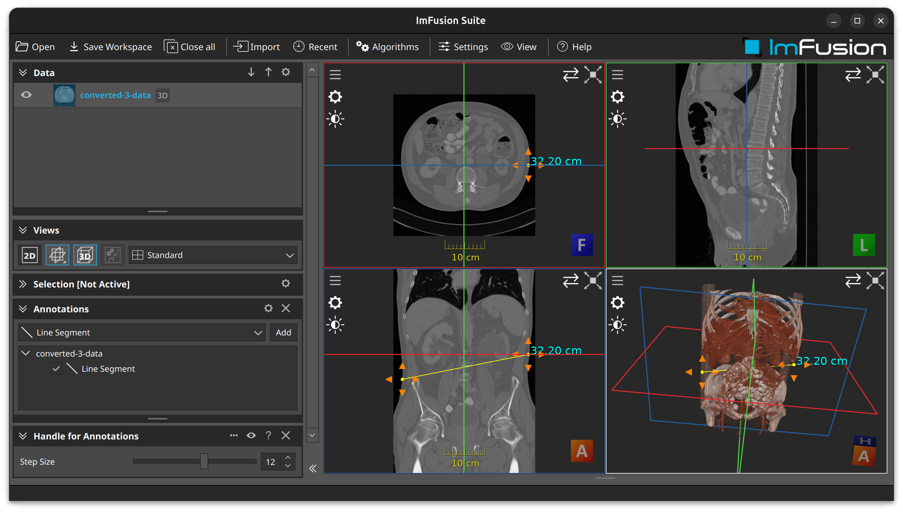

# Example Interactive Overlay Plugin

## Summary
This tutorial will explain how to build a simple interactive overlay for the ImFusion SDK.
It shows how to add overlay buttons to every point of a GlPointBasedAnnotation which can then be clicked by the user to move the associated annotation point.
Clicking an overlay button moves the associated annotation point with respect to the viewport space of the button. 

**Note:** This demo plugin is built upon the ExamplePlugin. Please refer to the README.md there for more details on setting up an ImFusionPlugin.

## Implementation details

- We implement our own `AnnotationHandleController` which has access to the `ImFusion::AnnotationModel` and also to all the views via the `ImFusion::DisplayWidgetMulti`. Here we take care of the creation and destruction of the `InteractiveAnnotationHandle` instances.
- In `GlAnnotationHandle` we take care of the rendering of the four arrow handles for each point of the associated `ImFusion::GlPointBasedAnnotation`.
- `InteractiveAnnotationHandle` takes care of the mouse interactions, i.e. checking if a handle was clicked and moving the corresponding point of the associated `ImFusion::GlPointBasedAnnotation` in the respective direction.
- In this example the `compute()` method is left empty as the main functionality was handled in the `AnnotationHandleController` and `InteractiveAnnotationHandle`.