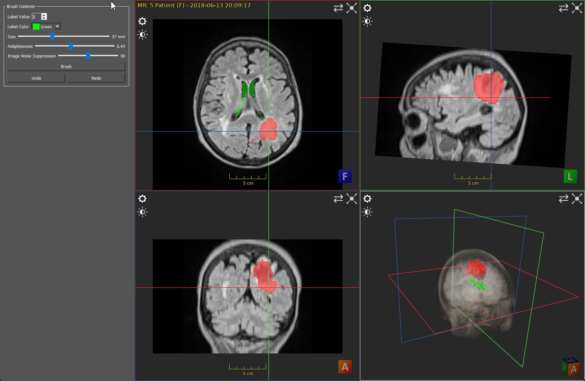

# Example Brush Standalone Application

## Summary

This tutorial builds on top of the "Example Standalone Application" tutorial and adds the functionality for semi-automatic labeling using the interactive brush of the ImFusion SDK.
This tutorial uses Qt as a GUI framework and requires the C++20 language standard.

## Requirements and Build Instructions

- Installed ImFusion SDK including the ImFusionDicom and the ImFusionSeg plugins
- Qt5 (at least the version that the ImFusion SDK comes with)
- CMake version 3.2 or newer

Use CMake to generate build/project files for your build system of choice.
In order to launch the application, you will need to make sure that it finds all required 3rd-party DLLs/SOs.
For this, your options include copying them next to your executable file, configuring the `PATH` environment variable correctly, or using the ImFusion Suite directory as working directory when executing the application.
If you are using Visual Studio, the CMake scripts will automatically configure the generated Solution with the correct environment parameters so that you can launch the example application directly from Visual Studio.

### Linking directly against ImFusion plugins

The BrushApplication target links directly against `ImFusionDicom` and `ImFusionSeg`, which are ImFusion plugins.
To make sure that these plugins are loaded at runtime, we need to set the `loadPlugins` boolean member of `Framework::InitConfig` to `true`.
Although you could initialize the plugin by instantiating its corresponding ImFusionPlugin class, this will not ensure that dependent parts or even the core ImFusionLib are initialized correctly.

## Standalone Application

The application allows loading a 3D DICOM dataset via command-line argument or, if the former is empty, via a dedicated File-Loading dialog.
Then, a Window with 3 MPR-views and a 3D-volume-view will be shown, displaying on the side the GUI elements needed to control the LabelMap and the Brush (see Screenshot above).

### BrushApplication Class

- [BrushApplication.h](BrushApplication.h)
- [BrushApplication.cpp](BrushApplication.cpp)

Every application using the ImFusion SDK is required to initialize the ImFusionLib and its plugins in an orderly fashion.
This can be done either using the free functions in the `ImFusion::Framework` namespace or by instantiating an `ImFusion::ApplicationController`.
In this example we define a new class `BrushApplication` that inherits from `ImFusion::ApplicationController` (see [BrushApplication.h](BrushApplication.h)).
Furthermore, we inherit from `QMainWindow` so that we can display a Qt GUI.

In [BrushApplication.cpp](BrushApplication.cpp), we take care of the implementation:\
First we initialize the `ApplicationController` and load/initialize additional plugins.\
We then setup the visualization by creating an `ImFusion::DisplayWidgetMulti`, wrapping it into a `QWidget` and creating the standard 3 MPR-Views + 1 Volume-View layout.\
We load data via the `ImFusion::DicomLoader` class to load DICOM data and have it display in the DisplayWidget (see `loadData(...)`).\
We setup the brushing tool by first creating a `LabelMap` compatible with the loaded image, this `LabelMap` will contain the result of the brush-segmentation.
Then, we create the low-level `Seg::LabelPainter` object, responsible for painting the LabelMap, and pass the LabelMap to the high-level `Seg::Brush` function, which facilitates the interaction with `Seg::LabelPainter` (see `BrushApplication::setupBrush(...)`).\
We then create all the GUI elements that control the brush behavior in the `BrushApplication::setupUI(...)` function and initialize them.

Additionally, the undo-functionality to revert (redo) the changes to the current LabelMap is implemented via the `Seg::UndoRecorder` object, which is setup in the `BrushApplication::setupUndo` member function.
Finally, we also need to define a main function as entry point to our standalone application.

For more documentation about `Seg::LabelPainter`, `Seg::Brush`, and other classes used in this tutorial, please refer to the general [SDK documentation](https://docs.imfusion.com/cppsdk/index.html) (also available in the `docs` subfolder of your ImFusion-SDK installation).