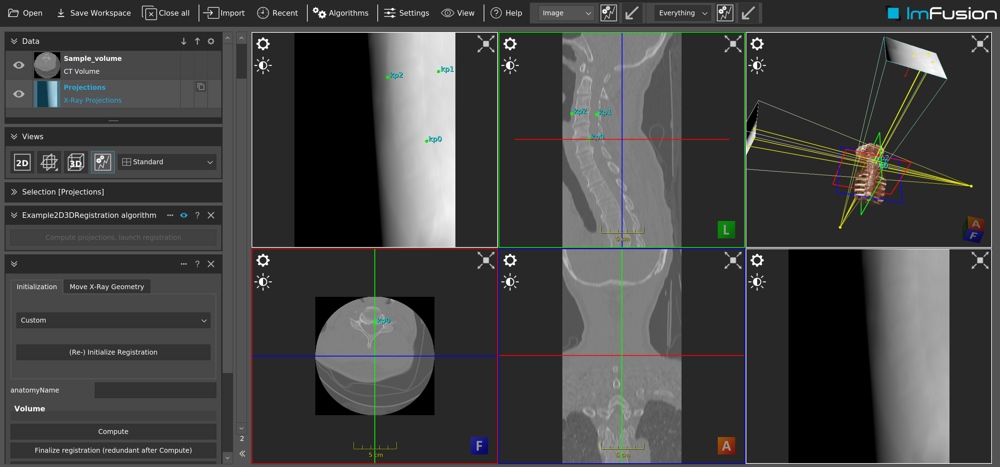

# Example X-Ray 2D/3D registration plugin

## Summary

This tutorial will explain how to use and customize the x-ray 2D/3D registration algorithm in an example plugin.

The screenshot above uses a Creative Commons Attribution-ShareAlike 4.0 (see https://osf.io/amh4f/ ) licensed CT volume from the 2020 VerSe Challenge (see citations below).

## Requirements and Build Instructions

- Installed ImFusion SDK including the CT Plugin.
- Qt5 (at least the version that the ImFusion SDK comes with)
- CMake version 3.2 or newer
- We encourage you to build the ExamplePlugin first and to familiarize yourself with its workings.

### The Example2D3DRegistrationAlgorithm class

Given a 3D volume, `Example2D3DRegistrationAlgorithm` class does two things:

- Compute simulated (cone-beam) X-ray images of the volume.
- Start an instance of the XRay2D3DRegistrationAlgorithm class (with custom initialization method) in order to run 2D/3D registration with the volume and the simulated X-ray images.

The initialization method used is quite basic, and builds on the keypoint initialization method defined in the `XRay2D3DRegistrationInitializationKeyPoints` class. It assumes that key points on the volume are known that correspond to fixed spatial locations. The coordinates of these "reference"
spatial locations are then projected onto the X-ray images. Finally, a bundle adjustment is computed in order to minimize the reprojection error of the forward-projection of the keypoints relative to the reference values.

### Citations

    Löffler M, Sekuboyina A, Jakob A, Grau AL, Scharr A, Husseini ME, Herbell M, Zimmer C, Baum T, Kirschke JS. A Vertebral Segmentation Dataset with Fracture Grading. Radiology: Artificial Intelligence, 2020 https://doi.org/10.1148/ryai.2020190138.
    Liebl H, Schinz D, Sekuboyina A, ..., Kirschke JS. A Computed Tomography Vertebral Segmentation Dataset with Anatomical Variations and Multi-Vendor Scanner Data. 2021. https://arxiv.org/abs/2103.06360
    Sekuboyina A, Bayat AH, Husseini ME, Löffler M, Menze BM, ..., Kirschke JS. VerSe: A Vertebrae Labelling and Segmentation Benchmark. 2021. https://arxiv.org/abs/2001.09193

