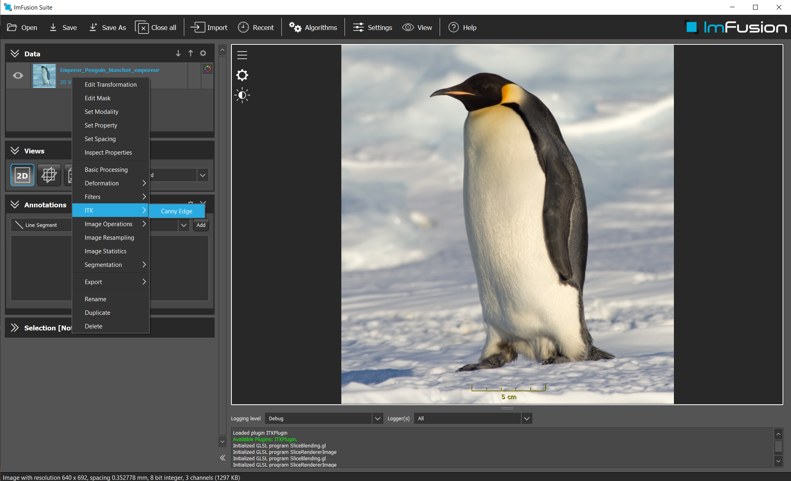
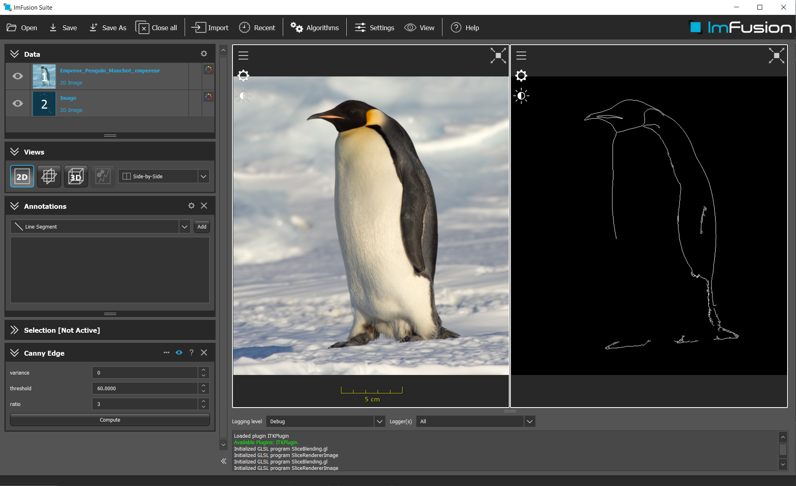

# Example ITK

## Summary
This example shows how to use ITK with the ImFusion SDK. 

## Requirements and Build Instructions
- Installed ImFusion SDK
- Qt5 (at least the version that the ImFusion SDK comes with)
- CMake version 3.2 or newer
- ITK version 5.0.1 or newer

Use CMake to generate build/project files for your build system of choice.
If you are using Visual Studio the CMake scripts will automatically configure the generated Solution with the correct environment parameters so that you can launch the ImFusion Suite including your plugin directly from Visual Studio.
If the ImFusion Suite does not pick up the built plugin on start, configure the `IMFUSION_PLUGIN_PATH` environment variable to contain .dll/.so directory.

The ITK_DIR in CMake should point to your ITK build folder.

## The ITK Example

### CMakeLists.txt
We use CMake as build system.
The [CMakeLists.txt](CMakeLists.txt) file defines the required input and configuration for building the demo plugin.
The first part contains the header section that defines the CMake project and locates 3rd-party libraries.
The second part defines the source files for the demo plugin and configures include directories as well as linker input.

### The Plugin and Factory classes
Please refer to the [DemoPlugin](../ExamplePlugin/README.md) to find more information on Plugin and Factory classes.

### The ITKCannyEdgeAlgorithm class
The `ITKCannyEdgeAlgorithm` class is a simple demonstration on how to use ITK filters in the ImFusion SDK.
On execution it will apply the Canny Edge filter on the selected image.
- [ITKCannyEdgeAlgorithm.h](ITKCannyEdgeAlgorithm.h)
- [ITKCannyEdgeAlgorithm.cpp](ITKCannyEdgeAlgorithm.cpp)

The `ITKCannyEdgeAlgorithm` uses the DefaultAlgorithmController, as it only has a few simple parameters.

This algorithm transforms an ImFusion TypedImage into an ITK image, in order to apply any ITK filter.
It uses `ITK::convert` to convert ImFusion structures to ITK, and viceversa.

This is the result after applying the algorithm

