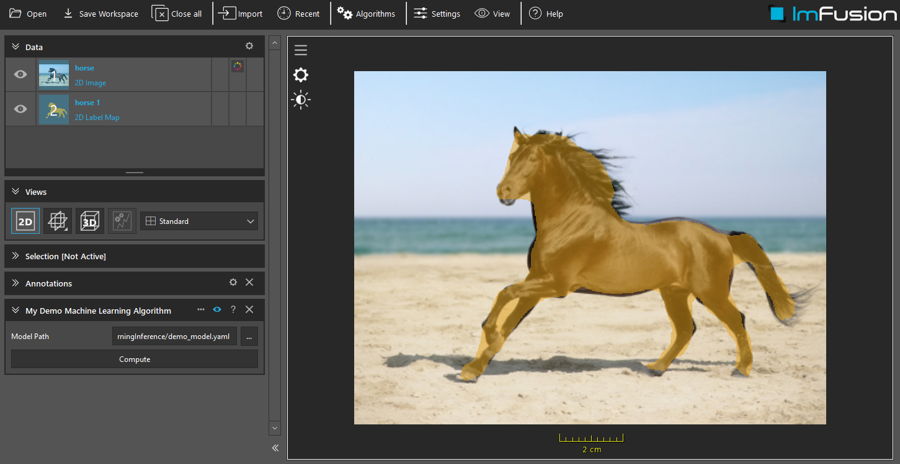

# Machine Learning Model Inference

## Summary

This tutorial describes how to use within the ImFusion framework a deep learning model that has been trained independently from Python.
The C++ plugin included in this repo will define a demo algorithm that runs such a model in the Suite.



## Requirements and Build Instructions
- Installed ImFusion SDK with ImageMathPlugin and TorchPlugin (or OnnxRuntimePlugin)
- Qt5 (at least the version that the ImFusion SDK comes with)
- CMake version 3.2 or newer

Use CMake to generate build/project files for your build system of choice.
If you are using Visual Studio the CMake scripts will automatically configure the generated Solution with the correct environment parameters so that you can launch the ImFusion Suite including your plugin directly from Visual Studio.
If the ImFusion Suite does not pick up the built plugin on start, configure the `IMFUSION_PLUGIN_PATH` environment variable to contain .dll/.so directory.

The two main deep learning engines supported in the ImFusion framework are [Torch](https://pytorch.org/) and [ONNXRuntime](https://onnxruntime.ai/) (experimental).

To make sure that you have the appropriate plugins (`TorchPlugin`, `OnnxRuntimePlugin`) installed with the Suite/SDK, you can start the ImFusion Suite or Console and look at the log window:
```
ImFusionLib Version x.x.x built on yyyy-mm-dd.
[OnnxRuntimePlugin] Providers: CUDAExecutionProvider
[OnnxRuntimePlugin] Providers: CPUExecutionProvider
[Framework] Available Plugins: [...], ImFusionML, OnnxRuntimePlugin, TorchPlugin [...]
```

## Step 1: Exporting trained models from PyTorch

### As Torch traced model

The currently supported version of PyTorch is 1.8 (or 1.5 for older versions of our SDK, or Windows VS2017 installers). 
Exporting the model with a different version of PyTorch may lead to incompatibility errors.

```python
# For 3D volumes
dummy_input = torch.rand(1, 1, 64, 64, 64) # batch x channels x slices x height x width
# For 2D images
dummy_input = torch.rand(1, 3, 256, 256) # batch x channels x height x width

traced_script_module = torch.jit.trace(model, dummy_input)
traced_script_module.save("traced_model.pt")
```

### As ONNX model

```python
# For 3D volumes
dummy_input = torch.rand(1, 1, 64, 64, 64) # batch x channels x slices x height x width
# For 2D images
dummy_input = torch.rand(1, 3, 256, 256) # batch x channels x height x width

# Define dynamic axes (that can be resized at inference time)
input_dynamic_axes = {0: 'batch', 2: 'width', 3: 'height', 4: 'depth'}
input_dynamic_axes = {dim: name for dim, name in input_dynamic_axes.items() if dim < len(dummy_input.shape)}

torch.onnx.export(model, dummy_input, "traced_model.onnx", input_names=['input'], dynamic_axes={'input': input_dynamic_axes})
```

Other models exported as ONNX (for instance converted from TensorFlow) can be used as long as they follow the same convention as described above.

## Step 2: Preparing the YAML model file

Once you have exported your model in a suitable format, you need to create a model configuration file with the YAML format.
This file will contain all the necessary information for the ImFusion framework to run it on an input image.

The section below shows an example of such a file.

```yaml
Version: 4.0
Type: NeuralNetwork
Name: Name of the model (no practical purpose)
Description: Description of the model (no practical purpose)
Engine: torch # Could be onnx
ModelFile: traced_model.pt # Path to the actual model file (could be a onnx file)
ForceCPU: false # Set it to true if you want to perform the inference on the CPU instead of the GPU
Verbose: false # Print many info messages
MaxBatchSize: 1 # Maximum number of images to run through the network simulatenously
LabelNames: [FirstObject, SecondObject] # Names of the different labels encoded as channels of the output tensor

#############################################################################################
# Sequence of preprocessing operations run before the network
# (all available operations are available in the Python documentation of the SDK)
#############################################################################################
PreProcessing:
  - MakeFloat: {} # First convert to float
  - BakeTransformation: {}  # If the image has a matrix, apply the transformation to the image
  - Resample: # Resample to a fixed resolution of 1.5mm
      resolution: 1.5 
  - NormalizePercentile:  # Normalize image intensities based on the image percentile
      min: 0.001
      max: 0.999
      clip: false

#############################################################################################
# For pixelwise (fully convolutional) models, it might be necessary to split the input in sub-images
# because of GPU memory constraints, especially for 3D volumes.
# Each of those images will be fed into the network and the predictions will be recombined.
# This section can be removed for imagewise models.
#############################################################################################
Sampling:
  # Maximum size of the sub-image (set to -1 if you never want to split the image)
  - MaxSizeSubdivision: 96
  # Some network architectures require each sub-image dimension to be a multiple of this number
  - DimensionDivisor: 16
  # Recommended for real-time applications when speed is paramount
  - SkipUnpadding: false
  # Sub-images are extracted with overlap in order to avoid border effect - this is the size in pixels of this overlap
  - PixelsOverlap: 32
  # Weigh the different contributions at each pixel of overlap regions based on their position
  - RecombineWeighted: true
  # Repeat border values or mirror pad when extracting sub-images at to the border
  - MirrorPadding: false

#############################################################################################
# Sequence of preprocessing operations run
# after the network and the recombination of the sub-images
# (all available operations are available in the Python documentation of the SDK)
#############################################################################################
PostProcessing:
  - ResampleToInput: {} # Resample the prediction image back to the original image
  - ArgMax: {}  # Convert the multi-channel probability map to a label map      
```


## Step 3a: Executing a model in the ImFusion Suite

The algorithm that runs a Machine Learning model in the Suite is `Run Machine Learning Model`.
It is available in the *Machine Learning* sub-menu of the algorithm list.

Select the path to the YAML model configuration file, and click on _Compute_.


## Step 3b: Executing a model from the ImFusion SDK

The aforementioned algorithm is a UI wrapper of the class `MachineLearningModel` which is available via our C++ SDK.
For more details, have a look at the source code of this sample plugin (in particular `RunPretrainedModelAlgorithm`), which consists in running a segmentation model after pre-processing the input.

In order to reproduce what is shown in the screenshot, build the `MachineLearningInferencePlugin` and start the ImFusionSuite.
Open the image `horse.png`, and select the new algorithm called _My Demo Machine Learning Algorithm_ in the _Machine Learning_ sub-menu.
Select the `demo_model.yaml` and click on Compute.

The segmentation model `demo_model_traced.pt` has been generated via the Python script `generate_demo_model.py`.

The expected input of this algorithm is a 2D RGB images with intensities between [0;255]. The applied pre- and post-processing operations are defined in the YAML file `demo_model.yaml`.
