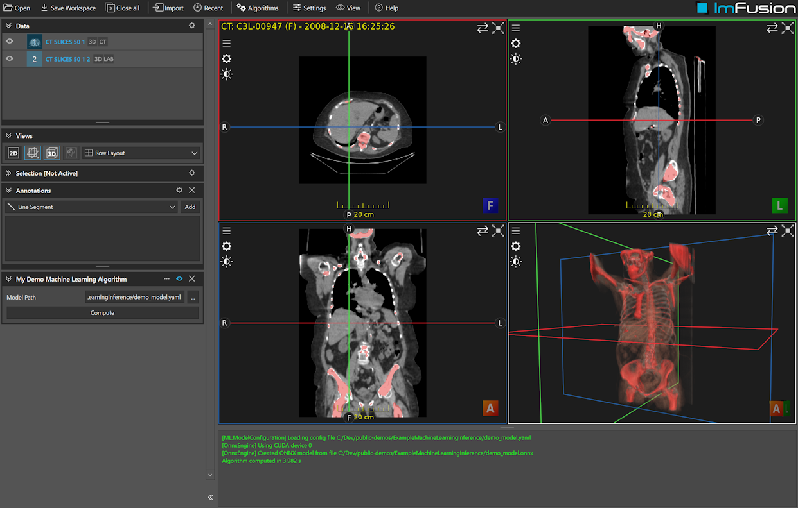

# Machine Learning Model Inference

## Summary

This tutorial explains how to integrate a deep learning model, trained independently using Python, into the ImFusion framework.
The C++ plugin included in this repo will define a demo algorithm that runs such a model in the Suite.



## Requirements and Build Instructions
- Installed ImFusion SDK with TorchPlugin (or OnnxRuntimePlugin)
- Qt5 (at least the version that the ImFusion SDK comes with)
- CMake version 3.2 or newer

Use CMake to generate build/project files for your build system of choice.
If you are using Visual Studio the CMake scripts will automatically configure the generated Solution with the correct environment parameters so that you can launch the ImFusion Suite including your plugin directly from Visual Studio.
If the ImFusion Suite does not pick up the built plugin on start, configure the `IMFUSION_PLUGIN_PATH` environment variable to contain .dll/.so directory.

The two main deep learning engines supported in the ImFusion framework are [Torch](https://pytorch.org/) and [ONNXRuntime](https://onnxruntime.ai/) (experimental).

To make sure that you have the appropriate plugins (`TorchPlugin`, `OnnxRuntimePlugin`) installed with the Suite/SDK, you can start the ImFusion Suite or Console and look at the log window:
```
ImFusionLib Version x.x.x built on yyyy-mm-dd.
[OnnxRuntimePlugin] Providers: CUDAExecutionProvider
[OnnxRuntimePlugin] Providers: CPUExecutionProvider
[Framework] Available Plugins: [...], ImFusionML, OnnxRuntimePlugin, TorchPlugin [...]
```

## Step 1: Exporting trained models from PyTorch

### As Torch traced model

The currently supported version of PyTorch is 1.8 (or 1.5 for older versions of our SDK, or Windows VS2017 installers). 
Exporting the model with a different version of PyTorch may lead to incompatibility errors.

```python
# For 3D volumes
dummy_input = torch.rand(1, 1, 64, 64, 64) # batch x channels x slices x height x width
# For 2D RGB images
dummy_input = torch.rand(1, 3, 256, 256) # batch x channels x height x width

traced_script_module = torch.jit.trace(model, dummy_input)
traced_script_module.save("traced_model.pt")
```

### As ONNX model

```python
# For 3D volumes
dummy_input = torch.rand(1, 1, 64, 64, 64) # batch x channels x slices x height x width
# For 2D RGB images
dummy_input = torch.rand(1, 3, 256, 256) # batch x channels x height x width

# Define dynamic axes (that can be resized at inference time)
input_dynamic_axes = {0: 'batch', 2: 'width', 3: 'height', 4: 'depth'}
input_dynamic_axes = {dim: name for dim, name in input_dynamic_axes.items() if dim < len(dummy_input.shape)}

torch.onnx.export(model, dummy_input, "traced_model.onnx", input_names=['input'], dynamic_axes={'input': input_dynamic_axes})
```

Other models exported as ONNX (for instance converted from TensorFlow) can be used as long as they follow the same convention as described above.

The script `generate_demo_model.py` shows how to trace a 2D model from torchvision.


## Step 2: Preparing the YAML model file

Once you have exported your model in a suitable format, you need to create a model configuration file with the YAML format.
This file will contain all the necessary information for the ImFusion framework to run it on an input image.

[An example of such a file](demo_model.yaml) is provided in this repo. More information is available in [the documentation](https://docs.imfusion.com/suite/Machine%20Learning/machinelearningmodel.html).


## Step 3a: Executing a model in the ImFusion Suite

The algorithm that runs a Machine Learning model in the Suite is `Run Machine Learning Model`.
It is available in the *Machine Learning* sub-menu of the algorithm list.

Select the path to the YAML model configuration file, and click on _Compute_.


## Step 3b: Executing a model from the ImFusion SDK

The aforementioned algorithm is a UI wrapper of the class `MachineLearningModel` which is available via our C++ SDK.
For more details, have a look at the source code of this sample plugin (in particular `RunPretrainedModelAlgorithm`), which consists in running a segmentation model after pre-processing the input.

In order to reproduce what is shown in the screenshot, build the `MachineLearningInferencePlugin` and start the ImFusionSuite.
Open the image `ct.imf`, and select the new algorithm called _My Demo Machine Learning Algorithm_ in the _Machine Learning_ sub-menu.
Select the `demo_model.yaml` and click on Compute.
The expected input of this algorithm is a 3D CT scan. The applied pre- and post-processing operations are defined in the YAML file [demo_model.yaml](demo_model.yaml).


## Acknowledgements

The data for this tutorial `ct.imf` is taken from:
	
National Cancer Institute Clinical Proteomic Tumor Analysis Consortium (CPTAC). (2019).  
The Clinical Proteomic Tumor Analysis Consortium Uterine Corpus Endometrial Carcinoma Collection (CPTAC-UCEC) (Version 12) [Data set].  
The Cancer Imaging Archive.  
https://doi.org/10.7937/K9/TCIA.2018.3R3JUISW
