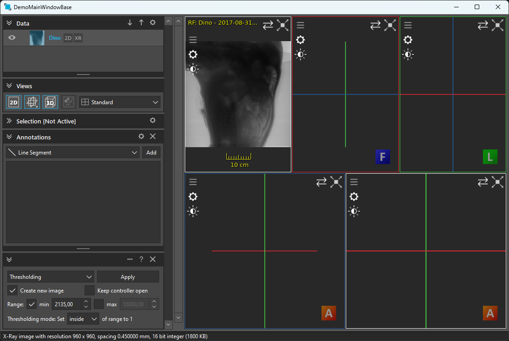

# Example MainWindowBase Standalone Application

## Summary
This tutorial will explain how to build a simple standalone application for displaying medical DICOM data.
We will use Qt widgets for the user interface.

## Requirements and Build Instructions
- Installed ImFusion SDK including the ImFusionDicom plugin
- Qt5 (at least the version that the ImFusion SDK comes with)
- CMake version 3.2 or newer

Use CMake to generate build/project files for your build system of choice.
In order to launch the application, you will need to make sure that it finds all required 3rd-party DLLs/SOs.
For this, your options include copying them next to your executable file, configuring the `PATH` environment variable correctly, or using the ImFusion Suite directory as working directory when executing the application.
If you are using Visual Studio the CMake scripts will automatically configure the generated Solution with the correct environment parameters so that you can launch the example application directly from Visual Studio.

**Note:** You may need to adjust the directory you load the plugins from to your local machine in the constructor of the `DemoMainWindowBase` class.

## The Standalone Application

### CMakeLists.txt
We use CMake as build system.
The [CMakeLists.txt](CMakeLists.txt) file defines the required input and configuration for building the application.
The first part contains the header section that defines the CMake project and locates 3rd-party libraries.
The second part defines the source files for the demo plugin and configures include directories as well as linker input.

### The DemoMainWindowBase class
Every application using the ImFusion SDK is required to initialize the ImFusionLib and its plugins in an orderly fashion.
This can be done using the free functions in the `ImFusion::Framework` namespace, by implementing `ImFusion::MainWindowBase` abstract class.
In this example we define a new class `DemoMainWindowBase` that inherits from `ImFusion::MainWindowBase`.
Furthermore, we inherit from `QMainWindow` so that we can display a Qt GUI. 

In the corresponding cpp file, we take care of the implementation.
First we initialize the `MainWindowBase` and load/initialize additional plugins.
We then setup the GUI by creating an `ImFusion::DisplayWidgetMulti`, wrapping it into a `QWidget`, and assigning it as central widget of the main window.
We also setup layout for displaying algorithm controllers and vertical scrollbar if there are multiple frames in the 2D view.
Furthermore, we create a standard 3 MPR + 1 Volume view layout.
Eventually, we use the `ImFusion::DicomLoader` class to load DICOM data and have it display in the DisplayWidget. 

Finally, we also need to define a main function as entry point to our standalone application. 
- [DemoMainWindowBase.h](DemoMainWindowBase.h) 
- [DemoMainWindowBase.cpp](DemoMainWindowBase.cpp)

### Linking directly against ImFusion plugins
The DemoMainWindowBase links directly against `ImFusionDicom`, which itself is an ImFusion plugin.
Also in cases like these, you will still need to properly initialize all plugins using either `Framework::loadPlugins()` or `ApplicationController::loadPlugins()`.
Though technically, you can initialize the plugin by instantiating its corresponding ImFusionPlugin class, this will not ensure that dependent parts or even the core ImFusionLib are initialized correctly.
