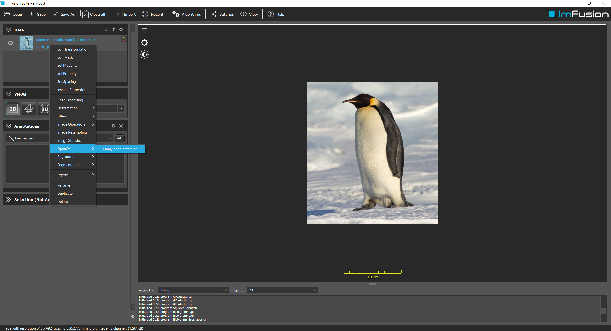
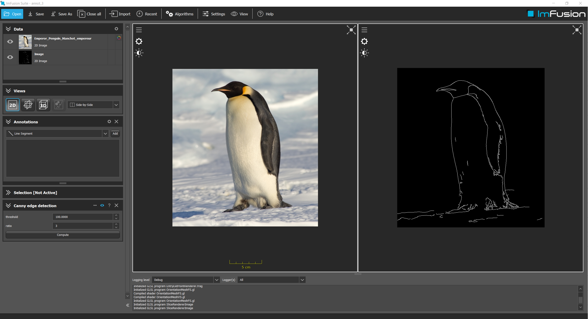

# Example OpenCV

## Summary
This example shows how to use OpenCV with the ImFusion SDK. 

## Requirements and Build Instructions
- Installed ImFusion SDK
- Qt5 (at least the version that the ImFusion SDK comes with)
- CMake version 3.2 or newer
- OpenCV (the version that the ImFusion SDK comes with)

Use CMake to generate build/project files for your build system of choice.
If you are using Visual Studio the CMake scripts will automatically configure the generated Solution with the correct environment parameters so that you can launch the ImFusion Suite including your plugin directly from Visual Studio.
If the ImFusion Suite does not pick up the built plugin on start, configure the `IMFUSION_PLUGIN_PATH` environment variable to contain .dll/.so directory.

The OpenCV_DIR in CMake should point to your OpenCV installation (i.e. OpenCV/3.1.0)

## The OpenCV Example

### CMakeLists.txt
We use CMake as build system.
The [CMakeLists.txt](CMakeLists.txt) file defines the required input and configuration for building the demo plugin.
The first part contains the header section that defines the CMake project and locates 3rd-party libraries.
The second part defines the source files for the demo plugin and configures include directories as well as linker input.

### The Plugin and Factory classes
Please refer to the [DemoPlugin](../ExamplePlugin/README.md) to find more information on Plugin and Factory classes.

### The CannyEdgeAlgorithm class
The `CannyEdgeAlgorithm` class is a simple demonstration on how to use OpenCV algorithms in the ImFusion SDK.
On execution it will apply the Canny Edge filter on the selected image.
- [CannyEdgeAlgorithm.h](CannyEdgeAlgorithm.h)
- [CannyEdgeAlgorithm.cpp](CannyEdgeAlgorithm.cpp)

The CannyEdgeAlgorithm uses the DefaultAlgorithmController, as it only has a few simple parameters.

This algorithm transforms an ImFusion SharedImage into a OpenCV matrix, in order to apply any OpenCV algorithm.
It uses `OpenCV::convert` to convert ImFusion structures to OpenCV, and viceversa.

This is the result after applying the algorithm

