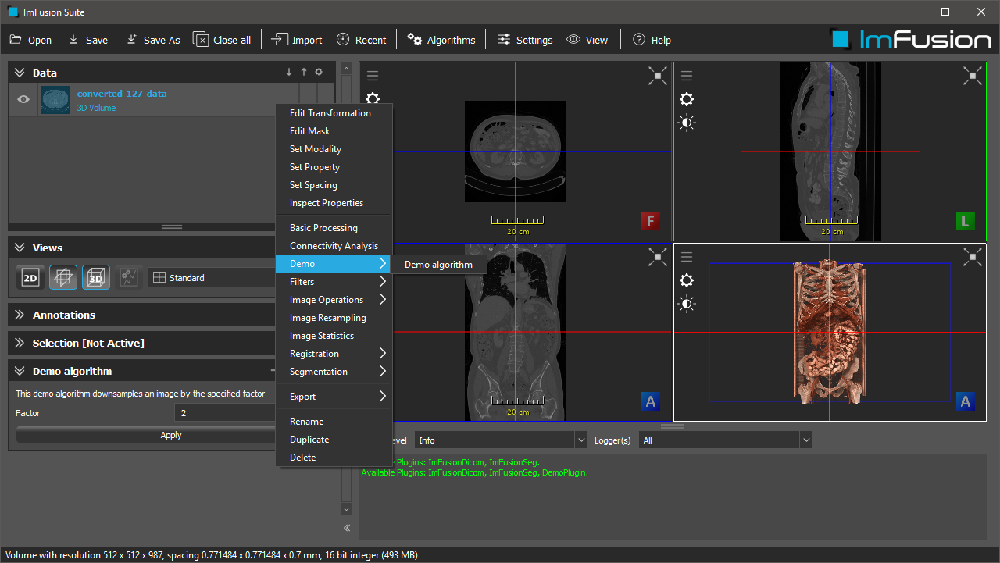

# Example Plugin

## Summary
This tutorial will explain how to build a simple custom plugin for the ImFusion SDK.
This plugin will extend the ImFusionLib with a custom algorithm and a custom algorithm GUI. 




## Requirements and Build Instructions
- Installed ImFusion SDK
- Qt5 (at least the version that the ImFusion SDK comes with)
- CMake version 3.2 or newer

Use CMake to generate build/project files for your build system of choice.
If you are using Visual Studio the CMake scripts will automatically configure the generated Solution with the correct environment parameters so that you can launch the ImFusion Suite including your plugin directly from Visual Studio.
If the ImFusion Suite does not pick up the built plugin on start, configure the `IMFUSION_PLUGIN_PATH` environment variable to contain .dll/.so directory.


## The Anatomy of an ImFusion Plugin

### The CMakeLists.txt
We use CMake as build system.
The [CMakeLists.txt](CMakeLists.txt) file defines the required input and configuration for building the demo plugin.
The first part contains the header section that defines the CMake project and locates 3rd-party libraries.
The second part defines the source files for the demo plugin and configures include directories as well as linker input.


### The DemoPlugin class
Every ImFusion SDK plugin must define a custom plugin class inheriting from `ImFusion::ImFusionPlugin`.
This base class defines the interface so that the ImFusionLib and the plugin can interact with each other (e.g. add algorithm factories).
If you need to do any initialization work (e.g. register device code repositories) you should do this in the `DemoPlugin` constructor.
See files [DemoPlugin.h](DemoPlugin.h) and [DemoPlugin.cpp](DemoPlugin.cpp)

**Note:** In addition to defining the DemoPlugin class, you must implement and export a factory function that will be called by the ImFusionLib in order to create the plugin. 
```cpp
#ifdef WIN32
extern "C" __declspec(dllexport) ImFusion::ImFusionPlugin* createPlugin()
{
    return new ImFusion::DemoPlugin;
}
#else
extern "C" ImFusion::ImFusionPlugin* createPlugin()
{
    return new ImFusion::DemoPlugin;
}
#endif
```


### The DemoAlgorithmFactory and DemoControllerFactory classes
As seen in the previous section the `DemoPlugin` instantiates a `DemoAlgorithmFactory` and a `DemoControllerFactory`.
These factories allow to add custom algorithms and controllers to the ImFusion SDK.
They will for instance appear in the algorithm menu of the ImFusion Suite.
- [DemoFactory.h](DemoFactory.h) 
- [DemoFactory.cpp](DemoFactory.cpp)


### The DemoAlgorithm and the corresponding DemoController
The `DemoAlgorithm` class is a simple demonstration of extending the Algorithm interface.
On execution it will downsample the input image by the specified factor.
- [DemoAlgorithm.h](DemoAlgorithm.h)
- [DemoAlgorithm.cpp](DemoAlgorithm.cpp)

The corresponding `DemoController` class implements a simple GUI for the demo algorithm using Qt Widgets.
- [DemoController.h](DemoController.h)
- [DemoController.cpp](DemoController.cpp)
- [DemoController.ui](DemoController.ui)

**Note:** Observe how both algorithm and controller are registered with the `DemoFactory` in [DemoFactory.cpp](DemoFactory.cpp). 
