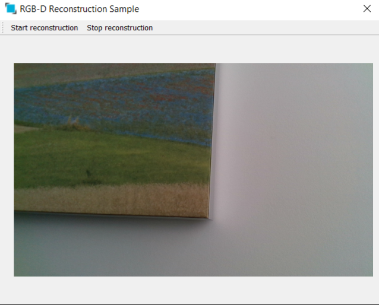

# Example RGBDReconstruction

## Summary
This tutorial will explain how to build a simple stand-alone against the ImFusion SDK. 

## Requirements and Build Instructions

- Installed ImFusion SDK including the ImFusionVision and the ImFusionRGBD plugins
- Qt5 (at least the version that the ImFusion SDK comes with)
- CMake version 3.2 or newer

Use CMake to generate build/project files for your build system of choice.
In order to launch the application, you will need to make sure that it finds all required 3rd-party DLLs/SOs.
For this, your options include copying them next to your executable file, configuring the `PATH` environment variable correctly, or using the ImFusion Suite directory as working directory when executing the application.
If you are using Visual Studio, the CMake scripts will automatically configure the generated Solution with the correct environment parameters so that you can launch the example application directly from Visual Studio.

### Linking directly against ImFusion plugins

The RGBDReconstruction target links directly against `ImFusionRGBD` and `ImFusionLib`, which are ImFusion plugins.
To make sure that these plugins are loaded at runtime, we need to set the `loadPlugins` boolean member of `Framework::InitConfig` to `true` or you could directly load the respective plugin as done in the code.

## Standalone Application

The application allows reconstruction of 3D surfaces in the form of a Mesh from RGBD sensor streams or playbacks. 