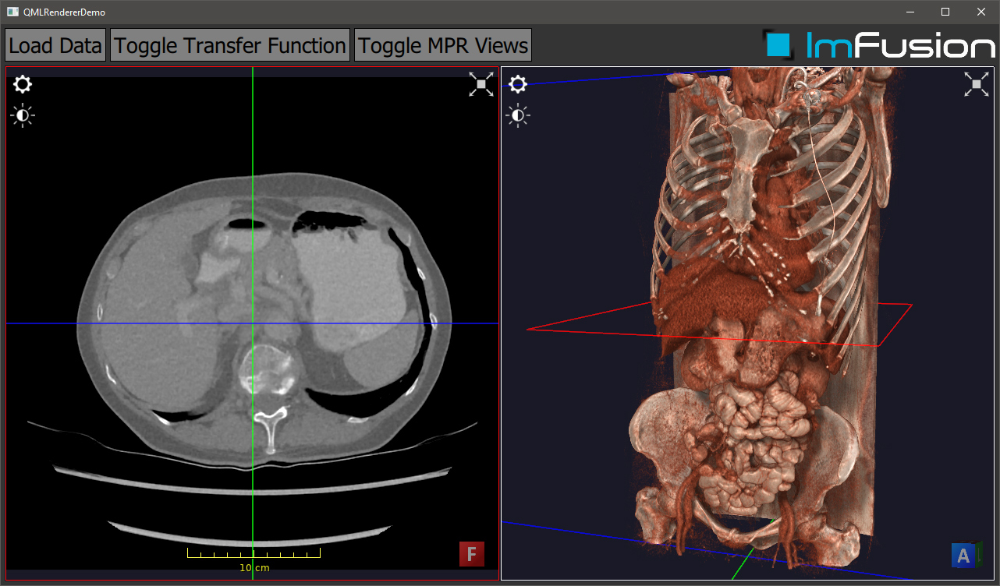

# Integration into an QML Application

## Summary
This tutorial will explain how to natively integrate the ImFusionLib rendering stack into a QML application.
The actual application is very minimalistic in order to put the focus on the integration aspects of QML and the ImFusion SDK.

## Requirements and Build Instructions
- Installed ImFusion SDK including the ImFusionDicom plugin
- Qt5 (at least the version that the ImFusion SDK comes with)
- CMake version 3.10 or newer

Use CMake to generate build/project files for your build system of choice.
In order to launch the application, you will need to make sure that it finds all required 3rd-party DLLs/SOs.
For this, your options include copying them next to your executable file, configuring the `PATH` environment variable correctly, or using the ImFusion Suite directory as working directory when executing the application.
Since the ImFusion SDK does not ship any QML/QtQuick DLLs, you might also need to put the bin/ directory of the matching Qt version into your `PATH`.
If you are using Visual Studio the CMake scripts will automatically configure the generated Solution with the correct environment parameters so that you can launch the example application directly from Visual Studio.

**Note:** You may need to adjust the directory you load the plugins from to your local machine in the `ImFusionClient::qtQuickOpenglContextCreated()` function.

## The QML Application

### CMakeLists.txt
We use CMake as build system.
The [CMakeLists.txt](CMakeLists.txt) file defines the required input and configuration for building the application.
The first part contains the header section that defines the CMake project and locates 3rd-party libraries.
The second part defines the source files for the demo plugin and configures include directories as well as linker input.

### The QML Application Part
The QML application part is rather minimalistic.
It consists of the following files:

The [main.cpp](main.cpp) sets two important Qt attributes before initializing the application:
- First, it sets the `QSG_RENDER_LOOP` to `basic` in order to force Qt Quick rendering to happen in the main GUI thread.
This simplifies the overall setup needed because we can be sure that all ImFusion SDK objects are accessed only from one thread.
See [the corresponding Qt documentation](https://doc.qt.io/qt-5/qtquick-visualcanvas-scenegraph.html#scene-graph-and-rendering) for more information.
There is also a [Qt example](https://doc.qt.io/qt-5/qtquick-scenegraph-textureinthread-example.html) for threaded-rendering of FBOs.
- Second, we set the `Qt::AA_ShareOpenGLContexts` attribute so that we can share OpenGL objects (e.g. textures) between the different OpenGL contexts.

The [MainWindow](MainWindow.cpp) class will show the QML scene graph described in [main.qml](main.qml) in a `QQuickView`.
The most important line is the connection to the `QQuickWindow::openglContextCreated` signal, which is forwarded to `ImFusionClient::qtQuickOpenglContextCreated()`.
This enables us to share the QML OpenGL context with the OpenGL contexts used by the ImFusion SDK.

### The ImFusionClient class
The [ImFusionClient](ImFusionClient.cpp) class provides the implementation for the basic integration of the ImFusion SDK.
It is implemented as a singleton to make global access easier, however this is not mandatory.
The `qtQuickOpenglContextCreated()` callback is called when the Qt Quick scene graph is ready and will initialize the ImFusion SDK sharing the QML OpenGL context.
The `qtQuickOpenglContextAboutToBeDestroyed()` callback will take care of properly deinitializing the ImFusion SDK at the right time.
Finally, it provides convenience functions fo loading images from disk using the ImFusion IoAlgorithm factories.

### The ImFusionFboView class
The [ImFusionFboView.h](ImFusionFboView.h) and [ImFusionFboView.cpp](ImFusionFboView.cpp) files take care of wrapping the ImFusion rendering stack into the Qt Quick screne graph.
This approach directly mirrors the [corresponding Qt example](https://doc.qt.io/qt-5/qtquick-scenegraph-textureinsgnode-example.html). 

The `ImFusionViewRenderer` class creates and holds an instance of the `ImFusion::DisplayWidgetMulti` class.
It hosts multiple ImFusion Views and renders them into an FBO provided by Qt Quick.

The `ImFusionFboView` class implements `QQuickFramebufferObject` which allows for direct integration as QML object.
It mainly acts as wrapper of the `ImFusionViewRenderer` and will forward input events to the `DisplayWidgetMulti` so that the user can use the default interaction metaphors to explore the loaded data.
Furthermore, it provides a few example functions illustrating how to change the appearence of the renderer.

