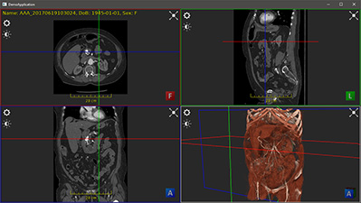
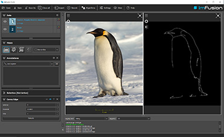

# Public Demos Repository
This repository hosts small example projects that can be built against the ImFusion SDK.
These projects are either standalone applications that demonstrate integrating the ImFusion SDK into custom applications or plugins that demonstrate how to extend the SDK with new functionality.

Please have a look at the individual subfolders of this repository.
Each provides a self-contained example to explore.

You can find more information on our company and what we do on our [website](https://www.imfusion.com).

## License and Copying
All projects and code in this repository are licensed under the permissive 3-clause BSD license. This allows you to freely modify and distribute the code as long as you retain a copy of the original copyright notice and do not use the name of the project or our company to promote derived work without written consent. For more details, please refer to the [LICENSE.txt](LICENSE.txt) file in this repository.
