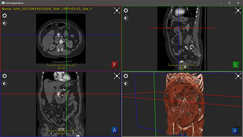
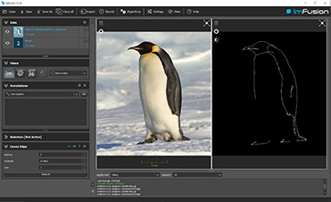

# Public Demos Repository
This repository hosts small example projects that can be built against the ImFusion SDK.
These projects are either standalone applications that demonstrate integrating the ImFusion SDK into custom applications or plugins that demonstrate how to extend the SDK with new functionality.

Please have a look at the individual subfolders of this repository.
Each provides a self-contained example to explore.

You can find more information on our company and what we do on our [website](https://www.imfusion.com).

## Examples

- **AnnotationHandle**: Explains how to add simple interactive handles to `GlPointBasedAnnotation` via a plugin.
- **BrushStandaloneApplication**: Builds a standalone application with an interactive Brush tool for labeling medical images.
- **Example2D3DRegistration**: Demonstrates how to use and customize the x-ray 2D/3D registration algorithm in an example plugin.
- **ExampleAnatomyPlugin**: Shows how you can use the AnatomyPlugin to represent `AnatomicalStructures` and combine them in a `AnatomicalStructureCollection`.
- **ExampleDicomBrowser**: Explains how to build a simple DICOM browser using the ImFusionDicom plugin.
- **ExampleDicomExtension**: Implements a sample `DicomExtension` to read and write custom DICOM tags.
- **ExampleImageMath**: Contains basic examples on how to use our ImageMath plugin.
- **ExampleITK**: Shows how to use ITK with the ImFusion SDK.
- **ExampleMachineLearningInference**: Explains how to integrate a deep learning model, trained independently using Python, into the ImFusion framework.
- **ExampleMainWindowBaseApplication**: Shows how to build a simple standalone application for displaying medical DICOM data using the ImFusion SDK.
- **ExampleOpenCV**: Demonstrates integration with OpenCV for computer vision tasks.
- **ExampleOpenGL**: Shows how to use OpenGL for rendering and image processing.
- **ExamplePlugin**: Provides a template for creating new plugins.
- **ExampleStandaloneApplication**: Builds a standalone application using the SDK.
- **QMLRendererDemo**: Explains how to natively integrate the ImFusionLib rendering stack into a QML application.
- **SlicerExtension**: Basic example demonstrating how the ImFusion SDK can be integrated into 3D-Slicer via an Extension module..
- **StreamExample**: Shows how to create `Stream`s and to work with their data.
- **TotalSegmentatorAnatomyPlugin**: Shows how to integrate  TotalSegmentator in a custom plugin and use it to create ImFusion anatomical structure descriptions.
- **TractographyPlugin**: Demonstrates how to create a custom data type (fiber tracts, used for instance in Diffusion Tensor Imaging) in the ImFusion SDK and integrate it into the visualization stack using the `GlObject` and `DataDisplayHandler` interfaces.

## License and Copying
All projects and code in this repository are licensed under the permissive 3-clause BSD license. This allows you to freely modify and distribute the code as long as you retain a copy of the original copyright notice and do not use the name of the project or our company to promote derived work without written consent. For more details, please refer to the [LICENSE.txt](LICENSE.txt) file in this repository.
