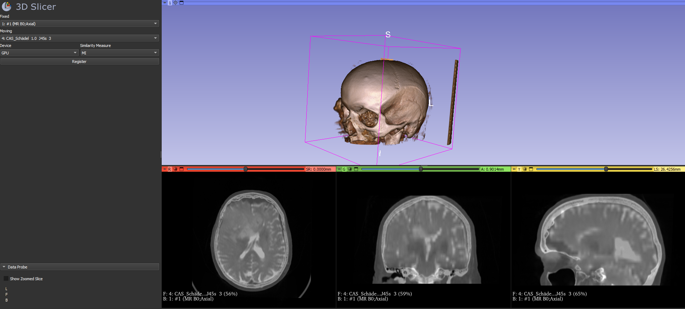
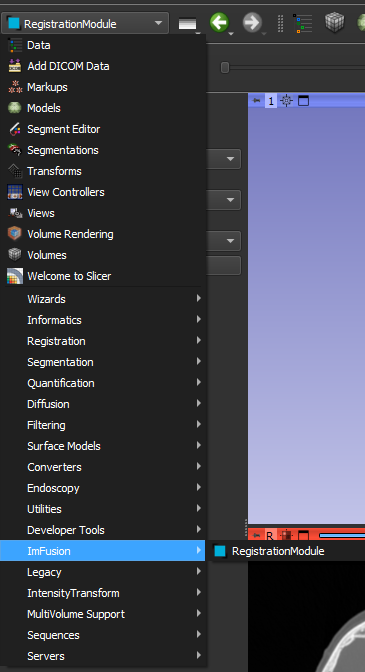
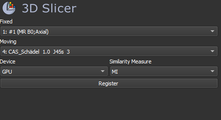

# ImFusion 3D-Slicer Extension (Registration Module)



This is a basic example demonstrating how the ImFusion SDK can be integrated into 3D-Slicer via an Extension module.
This extension allows you to register two images by performing a Linear Image Registration via the ImFusion SDK.

## Basic Usage

After building and starting this extension (see below), you can find switch to the extension module from the `Modules` menu of Slicer, under `ImFusion - Registration Module`.



Once the extension is selected from the Module menu, the corresponding GUI component opens:
The two combo boxes allow you to select the `Moving` and `Fixed` datasets for the registration. Only volume-datasets that have already been loaded into Slicer will be available in the boxes.
The `Device` combo box allows you to select the device that should run the algorithm (CPU or GPU, the second being the recommended default). The `Similarity measure` combo box allows you to select the similarity measure for this registration (defaults are available here too based on the dataset's modality).



## Requirements

1. Installed ImFusion SDK with Registration Plugin - **Note**: the path to the SDK should be in the PATH environment variable (e.g. `C:\Program Files\ImFusion\SuiteDev` and `C:\Program Files\ImFusion\SuiteDev\plugins` for the Debug version).
1. Qt version compatible with the ImFusion SDK
1. Build version of 3D Slicer (see [here](https://slicer.readthedocs.io/en/5.4/developer_guide/build_instructions/index.html) for instructions). It is important that the Qt version used to built slicer is compatible with the one of the ImFusion SDK.

## Code Structure

This is a CMake project that requires Slicer, so the parent `CMakeLists.txt` searches for the Slicer package and sets the needed variables (see [Slicer-Documentation](https://slicer.readthedocs.io/en/latest/developer_guide/extensions.html)).
The subfolder `ImFusionAlgorithmExample` contains the `C++` code for this extension.

- `qSlicerImFusionAlgorithmExampleModule`: contains initialization code to set e.g. the name of the extension, the logo shown in the Module menu etc. It is mostly standard for a Slicer Extension.
- `qSlicerImFusionAlgorithmExampleModuleWidget`: this class is a `qSlicerModuleWidget` which contains the logic for the GUI components of this module.
- `Resources/`:  contains the Resources for this module, such as the ImFusion Logo and the `.ui` file for the Module-Widget.
- `Logic/`: this folder contains the central part of the extension, the application logic. This component requires the `ImFusionLib` and `ImFusionReg` packages to link against them.

  - `vtkSlicerImFusionAlgorithmExampleLogic` is the application's logic class which converts Slicer data types (`vtkMRMLVolumeNode`) to ImFusion types (`TypedImage` and `SharedImageSet`), configures and starts the Image Registration Algorithm (`ImFusion::LinearImageRegistration`), and finally performs some additional operations such as centering the views on the data.  

## Build instructions

This is a CMake project, thus:

1. Configure the project and set the `Slicer_DIR` Cmake-variable to the `Slicer-build` directory inside the build directory of Slicer.
2. Set the ImFusionLib_DIR to the directory containing the cmake config files for the ImFusion SDK (e.g. `<ImFusionSDK_Installation_Path>/cmake`)
3. Generate and build.

    For Linux:

    ```bash
    mkdir build && cd build
    cmake .. -DSlicer_DIR=<Slicer-build-dir>/Slicer-build/ -DImFusionLib_DIR=<ImFusion-SDK-installation-dir>/cmake/ImFusionLib/
    make
    ```

## Running and debugging instructions

### Running 3D-Slicer with this extension

In the build folder of the `ImFusionSlicerExtension` you should find an executable named `SlicerWithImFusionSlicerExtension`. This executable starts 3D-Slicer and automatically loads this extension.

### Debugging this extension

You can debug this extension by starting 3D-Slicer with the following command:
`<Slicer_Build_Path>/Slicer-build/Slicer.exe --additional-module-paths <Extension_Build_Path>/lib/Slicer-5.3/qt-loadable-modules/Debug`.

You can then remote-attach to the `SlicerApp-real` process via your debugger and debug this extension.
