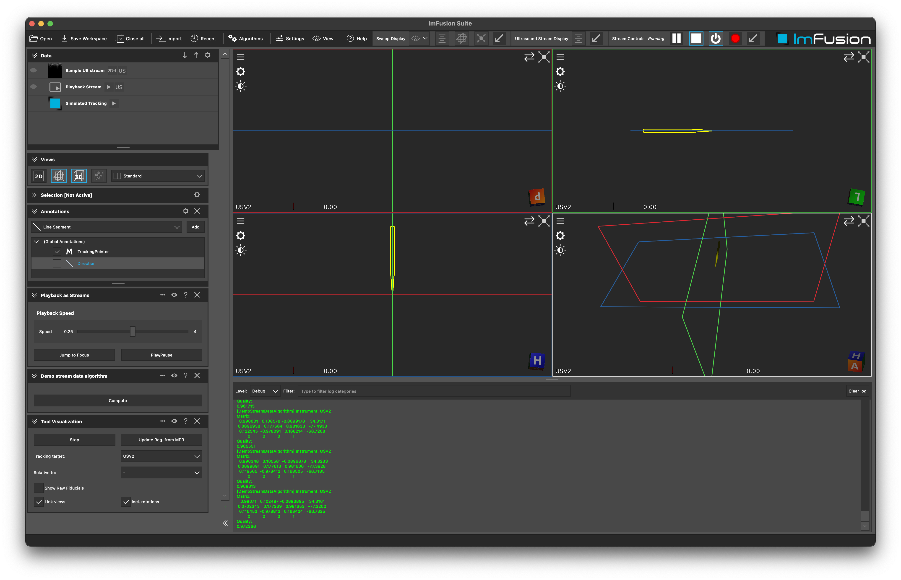

# Stream Examples

## Summary
Within this tutorial you will learn how to create `Stream`s and to work with their data.

The `DemoStreamDataAlgorithm` connects to a `TrackingStream`, e.g. coming for our NDIPlugin or any other source of tracking data, and uses the incoming tracking data in the `Algorithm`.
In this simple example we will simply print the tracking data to the console.

The `DemoInputImageStream` is a simple example of how to create a custom input stream, in this case for images, that can then be used by other algorithms and displayed live in the ImFusion Suite.

**Note:** This demo plugin is build upon the ExamplePlugin. Please refer to the README.md there for more details on setting up an ImFusionPlugin.

## Details

### DemoStreamDataAlgorithm

In the constructor of the `DemoStreamDataAlgorithm` (in `DemoStreamDataAlgorithm.h`) we register to the `signalNewData` of the `TrackingStream`. This signal is emitted whenever new tracking data is available.
We print all instruments available in the stream and print the current matrix, the name, and the quality.

Once the plugin is built, you can start the ImFusion Suite and create a tracking stream, e.g. the "Fake Tracking Stream" (Import -> Fake Tracking Stream).
Then you can start your algorithm by right clicking on the stream and selecting "Demo -> Demo Stream Data Algorithm". You should see the tracking data printed in the console.

### DemoInputImageStream

The most important parts of the `DemoInputImageStream` are the `...impl` methods and the `doWork` method. The `doWork` method is where the actual processing of the input stream happens. In this case, we create simplistic synthetig images emit them as new data in the stream. The `...impl` methods are called when the stream is requested to change state, e.g. by the user.

To execute the `DemoInputImageStream`, you can instantiate it in the ImFusion Suite by clicking "Demo -> Demo Input Image Stream". This will create a new input stream that will generate synthetic images and display them live in the ImFusion Suite.
