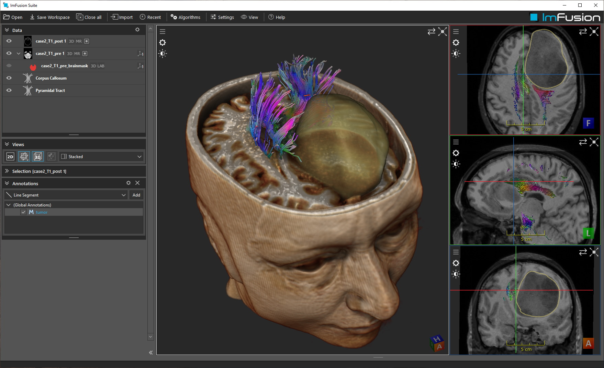
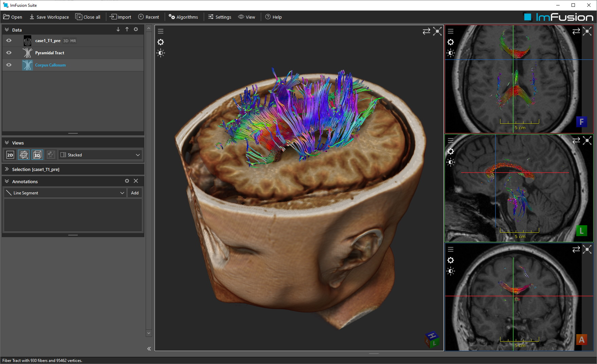

# Fiber Tract Plugin

## Summary
This example demonstrates how to create a custom data type (fiber tracts, used for instance in Diffusion Tensor Imaging) in the ImFusion SDK and integrate it into the visualization stack using the `GlObject` and `DataDisplayHandler` interfaces.
Have a look at the "ExamplePlugin" demo first if you need to familiarize yourself with the general anatomy of an ImFusion SDK plugin.

## Requirements and Build Instructions
- Installed ImFusion SDK
- Qt5 (at least the version that the ImFusion SDK comes with)
- CMake version 3.13 or newer

Use CMake to generate build/project files for your build system of choice.
If you are using Visual Studio the CMake scripts will automatically configure the generated Solution with the correct environment parameters so that you can launch the ImFusion Suite including your plugin directly from Visual Studio.
If the ImFusion Suite does not pick up the built plugin on start, configure the `IMFUSION_PLUGIN_PATH` environment variable to contain .dll/.so directory.

## The Anatomy of an ImFusion Plugin

### The CMakeLists.txt
The [CMakeLists.txt](CMakeLists.txt) file is a very normal description for an ImFusion SDK plugin.
The only extra thing compared to the "ExamplePlugin" is a call to `imfusion_compile_resource_repository()` to register GLSL shaders with the ImFusion Resource infrastructure.
This is needed since we are using custom OpenGL shaders in this plugin.

### The TractographyPlugin class
The [TractographyPlugin class](TractographyPlugin.cpp) takes care of registering the needed factories/interfaces used by our plugin:
- The `FiberDataIoAlgorithm` used for loading/saving fiber tract data from/to disk.
- The `FiberTractDataAnnotationFactory` that provides a description and UI icon for our custom `FiberData` type.
- The `FiberDataDisplayHandler` used to make `FiberData` visualizable in views.
- The `FiberDataRenderer::Options` DataComponent used to store render options of `FiberData` data and attach them directly to the data.

Registration happens either through implementation of the corresponding virtual member functions of the `TractographyPlugin` class or through calls to the corresponding registry instances in the `TractographyPlugin` constructor.

### The FiberData class
The `FiberData` class inherits from the `ImFusion::Data` interface so that it can serve as input/output of ImFusion Algorithms and be maintained by `ImFusion::DataModel`.
It stores the vertex and metadata information of a fiber tract, for instance reconstructed from a DTI acquisition.

### The FiberDataRenderer class
The `FiberDataRenderer` class serves as OpenGL-based renderer for `FiberData` instances.
It implements the `ImFusion::GlObject` interface so that it can be injected into the `ImFusion::GlView` rendering framework.

For configuration of the renderer (e.g. coloring mode) it defines a custom nested struct `FiberDataRenderer::Options` that implements the `ImFusion::DataComponent` interface.
This enables you to attach an instance of this struct directly to a `FiberData` instance (i.e. by accessing `FiberData::components()`) so that the render options can be naturally stored together with its parent data.

### The FiberDataDisplayHandler class
The `FiberDataDisplayHandler` class is the final puzzle piece of this example as it provides the ImFusion SDK with the knowledge how to generically display datasets of type `FiberData` using the `FiberDataRenderer`.
Therefore it implements the `ImFusion::DataDisplayHandler` interface with functions for showing/hiding a dataset in/from views.
Furthermore, it provides a function to create an instance of the `FiberDataRenderOptionsWidget` when the user clicks on the "display options" button in a view.

## Example Data
In case you do not have DTI/fiber tract datasets at your disposal you can use the datasets that we provide as part of this example:
- You can find [case1_corpus_callosum.trk](data/case1_corpus_callosum.trk) and [case1_pyramidal_tract.trk](data/case1_pyramidal_tract.trk) directly as part of this repository.
- More data can be downloaded [from our website](https://www.imfusion.com/downloads/github/TractographyPlugin_Data.zip).

Note: the original data is courtesy of Prof. B. Terwey, Klinikum Mitte, Bremen, Germany, and was originally provided as part of the [IEEE Visualization Contest 2010](https://sciviscontest.ieeevis.org/2010/data.html).

